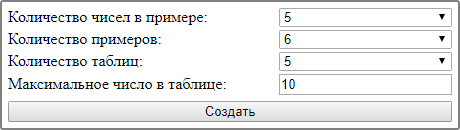
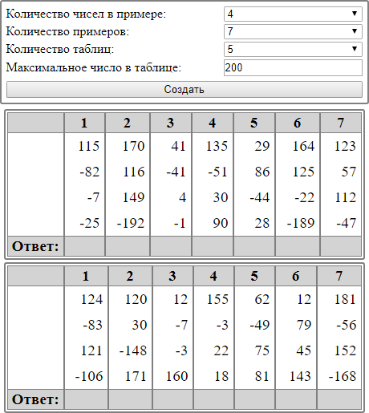

# MentalTables

## Описание

Генератор таблиц ментальной арифметики

## Установка

- Скачать [архив](distr/MentalTables.zip)
- Разархивировать
- Открыть в браузере `<path to MentalTables>\index.html`

## Вывод на печать

- Меню настроек скрывается
- На странице печатается по 4 таблицы

## Скриншоты

##### Рис.1 Начальная страница

##### Рис.2 Сгенерированные таблицы

